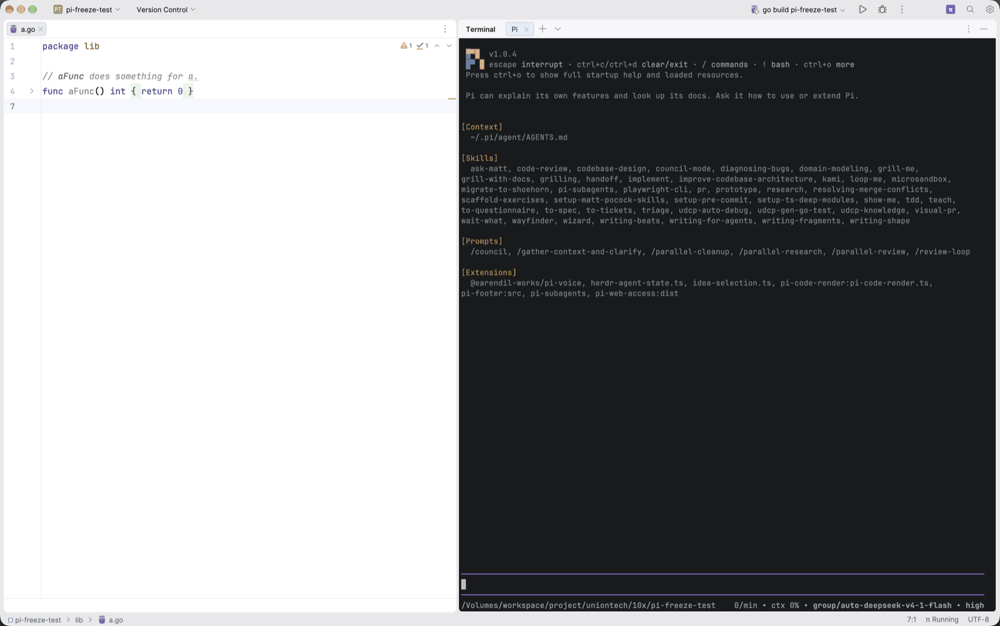
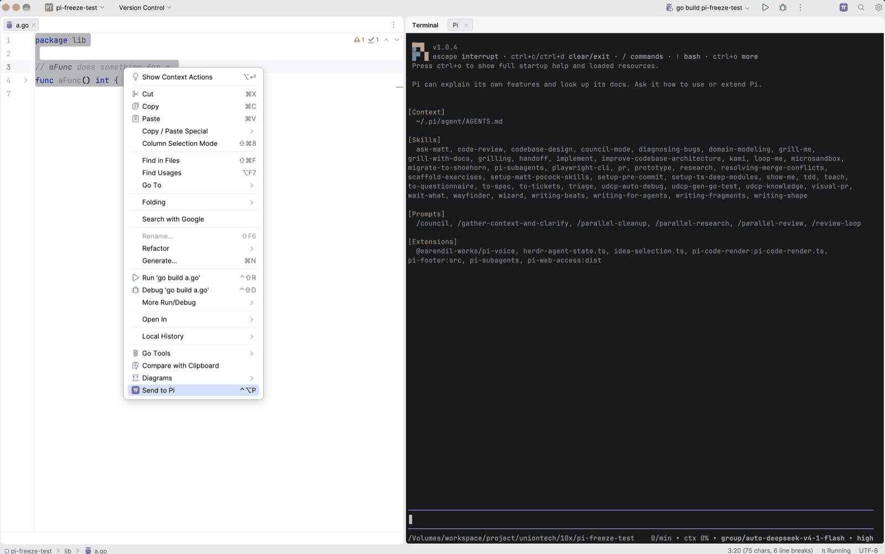
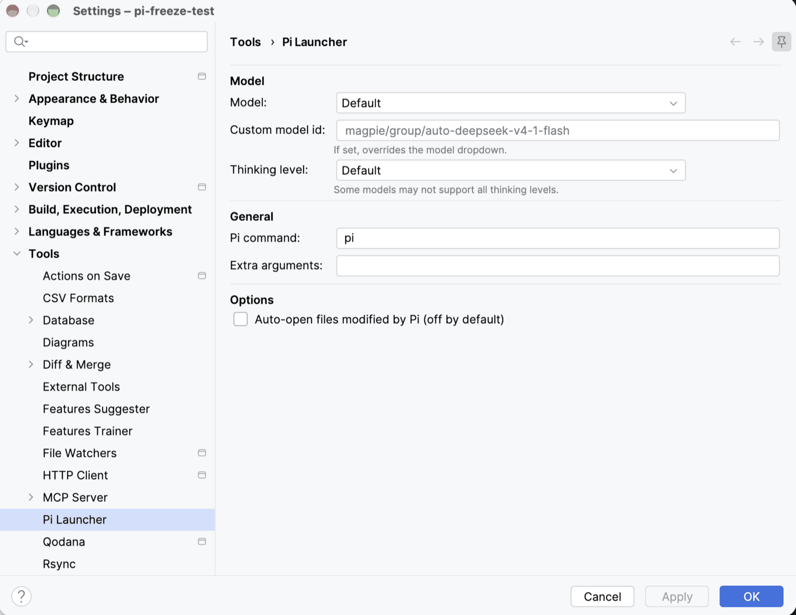

# Pi Launcher

[English](README.md)

一键启动 [Pi coding agent](https://pi.dev) 的 JetBrains IDE 插件 —— 在 Terminal 窗口中打开 "Pi 1"、"Pi 2"… tab 并自动启动 `pi`，可以同时跑多个会话。

[](LICENSE)

| | |
|---|---|
|  |  |

<p align="center">
  
</p>

## 功能

- **一键启动** — 点击工具栏 π 按钮启动 Pi
- **终端集成** — Pi 作为 IDE Terminal 窗口的一个 tab（和 Local 并列），每个会话一个 tab，可同时运行多个 Pi Session
- **新建会话** — Terminal tab 右键 → "New Pi Session" 再开一个会话
- **发送选区** — 选中代码 → 右键 → "Send to Pi"，自动插入 `@path/file.go#L10-25` 到当前会话（Active Session）输入框
- **状态栏指示** — 显示正在运行的会话数量，你退出后也会跟着更新
- **模型配置** — 从 `~/.pi/agent/models.json` 加载模型列表

所有会话共用同一套设置，命令在会话启动时取快照。

## 默认安静

Pi 一次 session 经常改写几十个文件。插件**不弹 diff**、**不弹逐文件通知**、**不上报退出**——把 100 个改动文件变成 100 个标签页是无法使用的。想看改动请用 `git diff`。

唯一会弹的通知：**你点启动但终端创建失败**时的错误提示。

如果你确实希望把改动文件开成普通编辑器标签，可在
**Settings → Tools → Pi Launcher → Auto-open files** 手动开启（默认关闭）。

## 快捷键

| 快捷键 | 功能 |
|--------|------|
| `Ctrl+Shift+Backquote` | 聚焦当前会话，没有会话时启动一个 |
| `Ctrl+Shift+L` | 发送选区到当前会话 |
| （无默认快捷键） | New Pi Session —— 另开一个会话，可在 Terminal tab 右键菜单或 Search Everywhere 中触发 |

## 快速开始

1. 安装插件
2. 确保 `pi` CLI 已安装且在 PATH 中：
   ```bash
   npm i -g @earendil-works/pi-coding-agent
   ```
3. 点击工具栏 **π** 按钮
4. Terminal 窗口中打开 "Pi 1" tab，自动启动 `pi`
5. 想再开一个会话：右键 Terminal tab → **New Pi Session**

## 配置

**Settings → Tools → Pi Launcher**

- **Model** — 从 `~/.pi/agent/models.json` 中选择模型
- **Custom model id** — 自定义模型标识符
- **Thinking level** — Default / none / low / medium / high / max
- **Pi command** — pi 二进制路径
- **Extra arguments** — 额外 CLI 参数
- **Auto-open files** — 默认关闭。开启后把改动文件开成普通编辑器标签（不会是 diff），带防抖与数量上限

## 支持的 IDE

支持所有 JetBrains IDE：IntelliJ IDEA、GoLand、PyCharm、WebStorm、PhpStorm、CLion、Rider、RubyMine 等。

## 为什么代码是这样组织的

设计由两条硬约束驱动：

1. **VFS 变更通知在后台线程到达。** 直接灌给编辑器 API 就是当年 GoLand 卡死的原因：一串写入 = 一串编辑器操作，不在 EDT 上，还和平台的读写锁赛跑。现在所有编辑器访问都经过 `PiChangeDebouncer`：合并突发、过滤无关变更、索引期间跳过、统一派发到 EDT。

2. **进程存活无法用常见 API 探测。** pty4j 本地终端的 `TtyConnector.isConnected()` 委托给短命的 spawn 辅助进程而非交互式 shell，而 `ShellTerminalWidget.hasRunningCommands()` 在该值为 false 时直接早退返回 false。`pid()` 才是真实子进程 pid，因此改为检查 shell 的进程树——并先拆掉 block 终端装的 RD connector 代理。

3. **两种终端引擎的 API 不一样。** 开 tab 用引擎无关的 `createShellWidget`（而不是 `createLocalShellWidget`：它会强转成 JediTerm widget，在 block 引擎上直接抛异常），并通过反射 + `setAccessible` 调用——因为经典引擎返回的是包私有桥接类。见 `docs/adr/0002`。

## 开发

```bash
# 构建
./gradlew build

# 单元测试
./gradlew test

# 沙箱 IDE 测试
./gradlew runIde

# 打包
./gradlew buildPlugin
```

## 许可证

MIT
